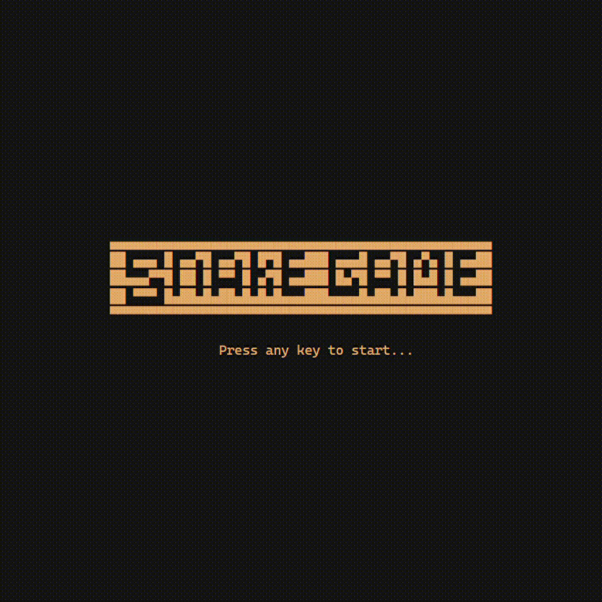

# snake_pygame

This is my simple snake game made with pygame

Preview below:




How to run it:

```
git clone https://github.com/thanhnamdev308/snake_pygame.git
```
```
cd snake_pygame && cd snake_game
```
```
python3 main.py
```

## If you don't want to open your terminal :)
Just download it as .zip and then execute <strong>run-game.bat</strong> (you must have Python3 on your computer).
